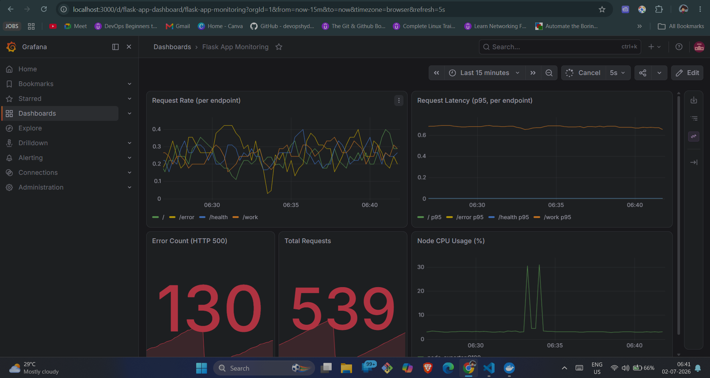

# Monitoring Stack: Flask + Prometheus + Grafana + Node Exporter

A self-contained observability stack demonstrating metrics collection, storage, and
visualization — the full pipeline: **App exposes metrics → Prometheus scrapes and
stores them → Grafana visualizes them**.

## Dashboard Preview



## Architecture
┌─────────────┐      scrape       ┌─────────────┐      query      ┌──────────┐
│  Flask App  │ ◄──── (pull) ──── │  Prometheus │ ◄──── (pull) ── │ Grafana  │
│  /metrics   │                   │  :9090      │                 │  :3000   │
└─────────────┘                   └─────────────┘                 └──────────┘
▲
│ scrape
┌─────────────┐
│node-exporter│  (host CPU / memory / disk metrics)
│   :9100     │
└─────────────┘

- **Flask app** — instrumented with `prometheus_client`. Exposes request count
  (Counter) and request latency (Histogram) at `/metrics`.
- **Node Exporter** — exposes host-level metrics (CPU, memory, disk, network).
- **Prometheus** — scrapes both targets every 15s and stores the time-series data.
  Config: `prometheus/prometheus.yml`.
- **Grafana** — queries Prometheus and renders dashboards. Datasource and a
  pre-built dashboard are auto-provisioned on startup — no manual clicking needed.

## Run it

```bash
docker compose up --build
```

Then open:
| Service      | URL                     | Notes                          |
|--------------|-------------------------|---------------------------------|
| Flask app    | http://localhost:5000   | `/`, `/health`, `/work`, `/error` |
| Prometheus   | http://localhost:9090   | Check **Status → Targets** to confirm all 3 targets are `UP` |
| Grafana      | http://localhost:3000   | login: `admin` / `admin`       |

Grafana dashboard **"Flask App Monitoring"** is auto-loaded on first startup
(no manual datasource/dashboard setup needed) — you'll find it on the home page.

## Generate traffic (so the dashboard isn't empty)

```bash
pip install requests
python load_generator.py
```

This hits the Flask endpoints repeatedly at random intervals, including the
`/error` endpoint, so you can watch the error-count panel move.

## What the dashboard shows

- **Request Rate per endpoint** — `rate(flask_app_request_count_total[1m])`
- **p95 Latency per endpoint** — `histogram_quantile(0.95, ...)`
- **Total error count** (HTTP 500)
- **Total requests**
- **Node CPU usage %** — from node-exporter

## Key Prometheus/PromQL concepts demonstrated

- **Counter** (`flask_app_request_count_total`) — monotonically increasing, use `rate()`
  to get per-second rate over a time window.
- **Histogram** (`flask_app_request_latency_seconds`) — bucketed observations,
  use `histogram_quantile()` to compute percentiles (p50, p95, p99).
- **Labels** (`endpoint`, `method`, `http_status`) — allow slicing metrics by
  dimension without creating separate metrics.
- **Pull-based scraping** — Prometheus initiates the scrape (unlike push-based
  systems like StatsD); this is why the app just exposes `/metrics` and does
  nothing else.

## Stopping / cleanup

```bash
docker compose down          # stop containers
docker compose down -v       # stop + delete stored metrics/dashboards data
```

## Project structure
.
├── app/
│   ├── app.py              # Flask app instrumented with Prometheus client
│   ├── requirements.txt
│   └── Dockerfile
├── prometheus/
│   └── prometheus.yml      # scrape targets & intervals
├── grafana/
│   └── provisioning/
│       ├── datasources/datasource.yml   # auto-adds Prometheus as datasource
│       └── dashboards/                  # auto-loads dashboard.json on startup
├── screenshots/
│   └── dashboard.png
├── docker-compose.yml
├── load_generator.py
└── README.md
